<!-- ════════════════════════ HEADER ════════════════════════ -->

  

 

## 👨‍💻 Sobre mí

Soy **Alvaro Aldama**, **Ingeniero en Sistemas** de 22 años en Toluca, México. Actualmente soy **Líder de Desarrollo de Software y TI** en **SICAMET**, un laboratorio de metrología acreditado bajo **ISO/IEC 17025**, donde también me desempeño como **Project Manager & IT** y soy el único responsable del área de Sistemas: desarrollo, infraestructura, soporte, documentación y capacitación.

Construyo **aplicaciones Full Stack escalables**, **PWAs**, **infraestructura en VPS con Docker** e **integraciones con Inteligencia Artificial** que resuelven problemas reales de operación. En paralelo trabajo como **desarrollador freelance** para PYMEs y emprendedores de todo México, creando webs modernas con animaciones, diseño responsive y posicionamiento **SEO / AEO / GEO**, además de bots de **WhatsApp y Telegram**.

 

---

## ⭐ Proyecto insignia — Ecosistema digital SICAMET

> Un ecosistema completo de software que diseñé, desarrollé y desplegué desde cero para digitalizar toda la operación de un laboratorio de metrología, **alineado a ISO/IEC 17025**.

### 🏢 CRM corporativo (+40 módulos)

| Área | Qué resuelve |
|---|---|
| 💼 **Comercial** | Creación y seguimiento de **cotizaciones**, catálogo de clientes y control de estatus |
| 🛠️ **Órdenes de servicio** | Alta y seguimiento de O.S.; **extracción automática del contenido con la API de Gemini** |
| 📏 **Metrología** | Flujo de calibración por equipo y magnitud, trazabilidad y control técnico |
| 📜 **Certificados** | Emisión y control de certificados con **comparativa asistida por IA** |
| 🧾 **Facturación** | Seguimiento de facturación ligado a cada servicio |
| ✅ **Calidad** | Registros y control documental conforme a ISO/IEC 17025 |
| 👥 **Recursos Humanos** | Gestión del personal y su desempeño |
| 📊 **Analítica** | Reportes mensuales de **KPIs** **cuellos de botella, SLA y desempeño por persona** |
| 💬 **Bot de WhatsApp** | Atención automatizada con **flujos configurables** desde el CRM |
| 🌐 **Portal del cliente** | **Estatus del equipo en tiempo real**, descarga de certificados e historial |
| 🔐 **Seguridad** | **2FA**, control de versiones, trazabilidad total y **3 niveles de respaldo** (Git, VPS y respaldo automatizado) |

### 🧩 Apps del ecosistema

| App | Descripción |
|---|---|
| 🔑 **Gestor de contraseñas** | Bóveda corporativa con 2FA, historial de versiones, permisos por rol y bitácora de accesos |
| 🎫 **Tickets & Proyectos** | Mesa de ayuda con login de Google, notificaciones por bot de Telegram, tablero de avance y evidencias |
| 🧾 **Generador de certificados (.exe)** | Genera certificados por magnitud (presión, volumen, temperatura, humedad y óptica): **+300 plantillas**, +1,900 clientes y salida en .docx |
| 🌡️ **Verificador de perfil térmico** | Valida valor por valor reportes PDF, libros de Excel protegidos e informes Word, procesando todo en local |
| 📈 **Analizador de datos** | Procesamiento de datos de Excel y R para reportes técnicos |

**Infraestructura:** VPS Hostinger con Docker · Cloudflare · DNS y subdominios · SSL · Git
**Stack:** `React` `Node.js` `Python` `Gemini API` `Claude API` `WhatsApp API` `Docker`

> 🔒 Sistemas privados bajo confidencialidad. Puedo mostrar la arquitectura o agendar una demo privada.

---

## 🛠️ Stack tecnológico

Haz clic en cualquier tecnología para abrir su documentación oficial

### Frontend

### Backend & Bases de datos

### DevOps & Infraestructura

### IA, Datos & Hardware

### APIs & Plataformas

---

## 💼 Experiencia

<table>
<tr><th>Rol</th><th>Empresa</th><th>Periodo</th><th>Logros</th></tr>
<tr>
<td><b>Líder de Desarrollo de Software y TI</b> Project Manager & IT</td>
<td>SICAMET Metrología · ISO/IEC 17025</td>
<td>Mar 2026 – Hoy</td>
<td>CRM de +40 módulos, portal de clientes, bot de WhatsApp, IA con Gemini, ecosistema de apps internas, VPS + Docker, documentación y capacitación al personal</td>
</tr>
<tr>
<td><b>Full Stack Developer & Soporte TI</b></td>
<td>BGITAL Telecomunicaciones</td>
<td>Nov 2025 – Mar 2026</td>
<td>PWA de tickets multi-empresa (<b>100% adopción, 80% mejora en tiempos</b>), ERP para ISP en 3 semanas, migración de <b>50,000+ registros</b> con 95% menos errores</td>
</tr>
<tr>
<td><b>Ingeniero en Sistemas</b> Servicio social</td>
<td>Instituto de la Defensoría Pública</td>
<td>Ene 2025 – Jun 2025</td>
<td>Sistema de inventario gubernamental con QR y soporte a +50 usuarios</td>
</tr>
<tr>
<td><b>Desarrollador Freelance</b></td>
<td>Proyectos independientes</td>
<td>2022 – Hoy</td>
<td>Webs para PYMEs, automatización con IA, PWAs, apps .exe, VPS y dominios</td>
</tr>
</table>

---

## 🚀 Proyectos públicos

<table>
<tr>
<td width="50%" valign="top">

### 💰 Fin Flow
PWA de finanzas personales con **IA**: dashboard, análisis predictivo y regla 50/30/20.

`React` `Firebase` `Firestore`

</td>
<td width="50%" valign="top">

### 📺 Stream Admin
PWA SaaS para vendedores de streaming: alertas, renovaciones, catálogos y métodos de pago.

`React` `Laravel` `MySQL`

</td>
</tr>
<tr>
<td width="50%" valign="top">

### 🧠 Sibelle Psicología
Landing profesional con servicios de terapia y contacto directo por WhatsApp.

`HTML` `CSS` `JS` `Netlify`

</td>
<td width="50%" valign="top">

### 💎 Huayra Mx
E-commerce de joyería con modo oscuro/claro, Mercado Pago y WhatsApp.

`HTML` `CSS` `JS`

</td>
</tr>
</table>

<b>📂 Otros proyectos (BGITAL, IDP, tesis)</b>

 

| Proyecto | Descripción | Stack |
|---|---|---|
| 📱 App Soporte BGITAL | PWA de servicio técnico en campo: geolocalización, modo offline y push | React · Firebase · Telegram |
| ✅ Work Flow BGITAL | Gestión de tareas por equipos con evidencias y notas | React · Laravel · Chart.js |
| 📦 Inventario IDP | Gestión de activos gubernamental con QR y reportes PDF/Excel | Laravel · Tailwind · MySQL |
| 🍿 Wacha Eri | Landing con menú digital y ubicación en Maps · [demo](https://wacha-eri.vercel.app/) | HTML · CSS · JS |
| ♻️ STMU-IA (tesis) | Clasificación de residuos con visión por computadora y brazo robótico | Python · YOLOv5 · PyTorch · Arduino |

---

## 📜 Certificaciones

Cada botón abre el certificado original en PDF

<table align="center">
<tr><th>Certificación</th><th>Institución</th><th>Año</th><th>Documento</th></tr>
<tr>
<td><b>Domina la IA con Gemini</b></td>
<td>Santander × Google</td>
<td align="center">2026</td>
<td align="center"></td>
</tr>
<tr>
<td><b>Build AI Apps con ChatGPT, DALL·E y GPT-4</b></td>
<td>Scrimba</td>
<td align="center">2026</td>
<td align="center"></td>
</tr>
<tr>
<td><b>Introduction to Generative AI</b></td>
<td>Google Cloud</td>
<td align="center">2026</td>
<td align="center"></td>
</tr>
<tr>
<td><b>ChatGPT — Prompt Engineering</b></td>
<td>Coursera</td>
<td align="center">2026</td>
<td align="center"></td>
</tr>
<tr>
<td><b>Fundamentos de Machine Learning</b></td>
<td>Pottencia</td>
<td align="center">2025</td>
<td align="center"></td>
</tr>
<tr>
<td><b>Python Essentials</b></td>
<td>Cisco Networking Academy</td>
<td align="center">2025</td>
<td align="center"></td>
</tr>
<tr>
<td><b>Data Science</b></td>
<td>Cisco Networking Academy</td>
<td align="center">2025</td>
<td align="center"></td>
</tr>
<tr>
<td><b>Fundamentos de IA</b></td>
<td>IBM SkillsBuild</td>
<td align="center">2025</td>
<td align="center"></td>
</tr>
<tr>
<td><b>Fundamentos de IA</b></td>
<td>Cisco Networking Academy</td>
<td align="center">2025</td>
<td align="center"></td>
</tr>
<tr>
<td><b>Bases clave de IA</b></td>
<td>Pottencia</td>
<td align="center">2025</td>
<td align="center"></td>
</tr>
<tr>
<td><b>Networking Basics</b></td>
<td>Cisco</td>
<td align="center">2025</td>
<td align="center"></td>
</tr>
<tr>
<td><b>Prompt Design in Vertex AI</b></td>
<td>Google Cloud (Credly)</td>
<td align="center">2024</td>
<td align="center"></td>
</tr>
<tr>
<td><b>Protección de Software e IA</b></td>
<td>Santander X</td>
<td align="center">2024</td>
<td align="center"></td>
</tr>
<tr>
<td><b>Python Programming</b></td>
<td>Santander Academy</td>
<td align="center">2024</td>
<td align="center"></td>
</tr>
<tr>
<td><b>Database Foundations</b></td>
<td>Oracle Academy</td>
<td align="center">2024</td>
<td align="center"></td>
</tr>
</table>

---

## 📊 Actividad en GitHub

  

<picture>
  <source media="(prefers-color-scheme: dark)" srcset="https://raw.githubusercontent.com/alvaro6ix/alvaro6ix/output/github-contribution-grid-snake-dark.svg" />
  <source media="(prefers-color-scheme: light)" srcset="https://raw.githubusercontent.com/alvaro6ix/alvaro6ix/output/github-contribution-grid-snake.svg" />
  
</picture>

---

## 🤝 Contacto

  

