

  

 

## `// 01` Sobre mí

Soy **Alvaro Aldama**, **Ingeniero en Sistemas** de 22 años en Toluca, México. Actualmente soy **Líder de Desarrollo de Software y TI** en **SICAMET**, un laboratorio de metrología acreditado bajo **ISO/IEC 17025**, donde soy el único responsable del área de Sistemas: desarrollo, infraestructura, soporte, documentación y capacitación.

Construyo **aplicaciones Full Stack escalables**, **PWAs**, **infraestructura en VPS con Docker** e **integraciones con Inteligencia Artificial** que resuelven problemas reales de operación. Además dirijo juntas de proyecto con dirección, capacito al personal y participo como expositor en temas de **metrología e IA aplicada al laboratorio**.

En paralelo trabajo como **desarrollador freelance** para PYMEs y emprendedores de todo México: webs modernas con animaciones, responsive y posicionamiento **SEO / AEO / GEO**, bots de **WhatsApp y Telegram**, automatizaciones con IA y despliegues en VPS.

 

---

## `// 02` Experiencia

### 🟢 SICAMET — Laboratorio de Metrología · ISO/IEC 17025

**Líder de Desarrollo de Software y TI** · `10 sep 2026 – Actualidad`

- Liderazgo del área de Sistemas y de la **hoja de ruta tecnológica** de la empresa: priorización de proyectos, arquitectura y estándares de desarrollo
- Dirección y evolución del **SICAMET CRM** (61 módulos en 12 áreas) y de todo el ecosistema de apps internas
- Desarrollo del **nuevo sitio web corporativo** en Next.js 16, migrado desde WordPress, con chatbot de IA y SEO / AEO / GEO
- Dirijo las **juntas de propuesta, capacitación y seguimiento** con dirección y áreas operativas
- **Capacitación al personal** en todos los sistemas, con instructivos y manuales interactivos por aplicación
- **Expositor en ponencias de metrología** sobre el uso de IA en el laboratorio, como *Inteligencia Artificial en la validación de hojas de cálculo* (3er Encuentro de Metrología, ISO/IEC 17025 §7.11.2)

**Project Manager & IT** · `Mar 2026 – Sep 2026`

- Diseñé y desarrollé desde cero el **CRM completo de SICAMET**, alineado a ISO/IEC 17025: cotizaciones, órdenes de servicio, metrología, aseguramiento, certificados, facturación, entregas, calidad y RH
- **Extracción automática de órdenes de servicio con la API de Gemini**, comparativa de certificados con IA y analítica mensual de cuellos de botella, SLA y desempeño por persona
- **Bot de WhatsApp** con flujos configurables y **portal externo del cliente** con estatus en tiempo real y descarga de certificados
- **Generador de certificados (.exe)** con +300 plantillas por magnitud, sobre una base de +1,900 clientes y 16 signatarios
- **Gestor de contraseñas corporativo** con 2FA, historial de versiones, permisos por rol y bitácora de accesos
- **Sistema de Tickets & Proyectos** con login de Google, notificaciones por Telegram y tablero de avance
- **Verificador de perfil térmico** y analizador de datos en Excel / R para validación técnica
- Infraestructura en **VPS Hostinger con Docker**, Cloudflare, DNS, subdominios, SSL, **2FA** y **3 niveles de respaldo** (Git, VPS y respaldo automatizado)
- Automatización de archivos y datos, soporte TI (servidor, hardware, software y usuarios), firmas de correo corporativas y material gráfico institucional

`React` `Next.js` `Node.js` `Python` `Gemini API` `Claude API` `WhatsApp API` `Telegram API` `Docker` `VPS` `Cloudflare` `ISO 17025`

### ⚪ BGITAL — Telecomunicaciones

**Full Stack Developer & Soporte TI** · `Nov 2025 – Mar 2026`

- PWA de tickets multi-empresa con chat en tiempo real, notificaciones por Telegram y gestión de roles: **100% de adopción y 80% de mejora en tiempos**
- Prototipo de **ERP para ISP en 3 semanas**: geolocalización, contratos, inventario, PDFs y dashboards
- Automatización en Python para migrar **+50,000 registros CSV → SQL**, reduciendo errores en 95%
- Soporte técnico empresarial, correos, hosting y DNS

`Laravel` `React` `MySQL` `Firebase` `Python` `Telegram API` `PWA`

### ⚪ Instituto de la Defensoría Pública (IDP)

**Ingeniero en Sistemas · Servicio social** · `Ene 2025 – Jun 2025`

- Sistema de inventario gubernamental con generación de QR y reportes PDF / Excel
- Soporte técnico a **+50 usuarios** y diseño de publicaciones institucionales

`Laravel` `PHP` `MySQL` `Tailwind` `Canva`

### ⚪ Desarrollador Freelance

**Proyectos independientes** · `2022 – Actualidad`

- Webs, landings y e-commerce para PYMEs y emprendedores
- Automatización con Python, Node.js e IA (Gemini / Claude), PWAs y ejecutables .exe
- Despliegue y administración de VPS, Docker, dominios, subdominios y DNS

---

## `// 03` Proyecto insignia


 

**SICAMET CRM** es la plataforma que digitaliza toda la operación del laboratorio: desde que un cliente pide una cotización, pasando por la recepción del equipo, la calibración, el aseguramiento de calidad y la firma del certificado, hasta la facturación y la entrega. Es el proyecto con mayor impacto que he desarrollado.

| Área | Módulos |
|---|---|
| **🏠 Inicio** | Dashboard · Pipelines Kanban |
| **💼 Cotizaciones** | Items · Crear cotización · Análisis de cotizaciones · Configuración |
| **📥 Registro** | Registro ágil · Lista general de equipos · Crear O.S. · Notificaciones de recepción · O.S. creadas · Numeración de certificados · Consulta de certificados · Catálogo de claves · Configuración de O.S. · Configuración de notificaciones |
| **👥 Clientes** | Clientes · Clientes a crédito · Posibles clientes (leads) · Portal del cliente |
| **💬 WhatsApp Bot** | Flujos configurables · Conversaciones · Vinculación por QR · Feedback del bot |
| **📚 Catálogos** | Instrumentos · Marcas · Modelos · Patrones de referencia · Unidades de medida · Magnitudes · CP SEPOMEX · Agenda de certificados · CMC · Prefijos de certificado |
| **📏 Metrología** | Centro de metrología · Bandeja del coordinador · Calendario del coordinador · Mi bandeja · Mis envíos · Correcciones · Incidencias · **Comparativa IA** · Recalibración |
| **✅ Aseguramiento** | Dashboard de aseguramiento · Gestión operativa (validación) · Mis decisiones |
| **✍️ Certificados y firmas** | Certificación ágil · Equipos sin certificado · Firmas · Facturación · Entregas |
| **📘 Gestión de calidad** | Noticias · Instrucciones · Procedimientos · Instructivo del CRM |
| **🧑‍💼 Personal / RH** | Personal · Mi expediente |
| **⚙️ Administración** | Eliminaciones · Gestión de usuarios y roles · Días festivos · Analytics |

**Además:** 2FA · control de versiones y trazabilidad total · 3 niveles de respaldo · roles y permisos por usuario · despliegue en VPS con Docker y Cloudflare.

`React` `Node.js` `Python` `Gemini API` `WhatsApp API` `Docker` `VPS Hostinger` `Cloudflare` `ISO/IEC 17025`

<b>🧩 Apps que completan el ecosistema SICAMET</b>

 

| App | Descripción | Stack |
|---|---|---|
| 🌐 **Portal de certificados** | Portal externo: estatus del equipo en tiempo real, descarga de certificados e historial, con 2FA | React · Node.js · 2FA · Cloudflare |
| 🧾 **Generador de certificados (.exe)** | Arma certificados por magnitud (presión, volumen, temperatura, humedad y óptica) con trazabilidad a patrones CENAM; +300 plantillas y salida .docx | Python · Excel · Word |
| 🔑 **Gestor de contraseñas** | Bóveda corporativa con 2FA, historial de versiones, permisos por rol y bitácora | Node.js · Docker · VPS |
| 🎫 **Tickets & Proyectos** | Mesa de ayuda con Google Auth, notificaciones por bot de Telegram, tablero de avance y evidencias | React · Node.js · Telegram |
| 🌡️ **Verificador de perfil térmico** | Valida valor por valor reportes PDF, libros de Excel protegidos e informes Word, todo en local | Python · R · .exe |

> 🔒 Sistemas privados bajo confidencialidad. Puedo mostrar la arquitectura o agendar una demo privada.

---

## `// 04` Stack tecnológico

Haz clic en cualquier tecnología para abrir su documentación oficial

#### Frontend

<a href="https://gsap.com" target="_blank" title="GSAP">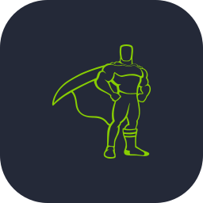</a>
<a href="https://motion.dev" target="_blank" title="Framer Motion">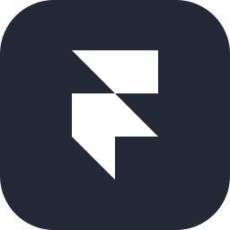</a>
<a href="https://web.dev/explore/progressive-web-apps" target="_blank" title="PWA">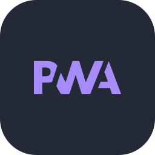</a>

#### Backend & Bases de datos

#### IA, Bots & Visión por computadora

#### DevOps & Infraestructura

<a href="https://www.hostinger.com/vps-hosting" target="_blank" title="Hostinger VPS">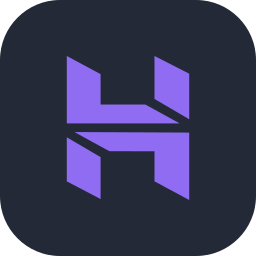</a>

#### Datos, Hardware & Integraciones

<a href="https://www.chartjs.org" target="_blank" title="Chart.js">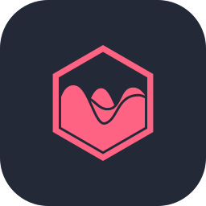</a>

 


---

## `// 05` Proyectos

### 🚧 Sitio web SICAMET — *en desarrollo*

Rediseño completo del sitio corporativo **sicamet.mx**, migrado de WordPress a **Next.js 16**. Incluye **chatbot con Gemini**, mapa 3D de contacto con **Mapbox GL**, **diagrama interactivo** del proceso de quejas ISO 17025, las 12 acreditaciones EMA con sus PDFs, modo claro / oscuro con View Transitions, animaciones con **GSAP + ScrollTrigger + Lenis** y **SEO / AEO / GEO** con JSON-LD (Organization, LocalBusiness, FAQPage, Breadcrumb), sitemap, robots y `llms.txt`.

`Next.js 16` `React 19` `TypeScript` `Tailwind CSS v4` `GSAP` `ScrollTrigger` `Lenis` `Framer Motion` `Embla Carousel` `Mapbox GL` `Gemini API` `MDX` `Web3Forms` `lucide-react` `SEO · AEO · GEO`

<table>
<tr>
<td width="50%" valign="top">

### 💰 Fin Flow
PWA de finanzas personales con **agentes de IA**: dashboard, análisis psicológico y predictivo, regla 50/30/20 y **generador de informes en PDF y Excel**.

`React` `Tailwind CSS` `Firebase Auth` `Firestore` `Firebase Hosting` `PWA` `Agentes de IA` `PDF` `Excel`

</td>
<td width="50%" valign="top">

### 📺 Stream Admin
PWA SaaS para vendedores de streaming: dashboard, alertas de vencimiento, renovaciones, catálogos, perfiles y métodos de pago.

`React` `Laravel` `MySQL` `REST API` `PWA` `Dashboard`

</td>
</tr>
<tr>
<td width="50%" valign="top">

### 🧠 Sibelle Psicología
Landing profesional: servicios de terapia, regularización académica, consultas online y contacto directo por WhatsApp.

`HTML5` `CSS3` `JavaScript` `Responsive` `SEO` `WhatsApp` `Netlify`

</td>
<td width="50%" valign="top">

### 💎 Huayra Mx
E-commerce de joyería por secciones con modo oscuro / claro, pagos con Mercado Pago y pedidos por WhatsApp.

`HTML5` `CSS3` `JavaScript` `Mercado Pago` `WhatsApp` `Responsive` `Vercel`

</td>
</tr>
<tr>
<td width="50%" valign="top">

### 🍿 Wacha Eri
Landing para negocio de snacks: menú digital, botones funcionales, redes, ubicación con Google Maps y menú físico.

`HTML5` `CSS3` `JavaScript` `Google Maps` `Canva` `Vercel`

</td>
<td width="50%" valign="top">

### ♻️ STMU-IA — Tesis
Clasificación de residuos reciclables con **visión por computadora**, panel de control, gráficas, cámara web y brazo robótico.

`Python` `YOLOv5` `PyTorch` `OpenCV` `Arduino` `IoT`

</td>
</tr>
</table>

<b>📂 Más proyectos privados (BGITAL · IDP)</b>

 

| Proyecto | Descripción | Stack |
|---|---|---|
| 📱 App Soporte BGITAL | PWA de servicio técnico en campo: geolocalización, modo offline, push y dashboard en tiempo real | React · Firebase · PWA · Telegram API |
| ✅ Work Flow BGITAL | Tareas por equipos, fechas límite, notificaciones, evidencias y notas colaborativas | React · Laravel · Chart.js |
| 📦 Inventario IDP | Activos gubernamentales con QR, reportes PDF / Excel y control de resguardos | Laravel · Tailwind · MySQL |

---

## `// 06` Certificaciones

Cada botón abre el certificado original en PDF

<table align="center">
<tr><th>Certificación</th><th>Institución</th><th>Año</th><th>Documento</th></tr>
<tr><td><b>Domina la IA con Gemini</b></td><td>Santander × Google</td><td align="center">2026</td><td align="center"></td></tr>
<tr><td><b>Build AI Apps con ChatGPT, DALL·E y GPT-4</b></td><td>Scrimba</td><td align="center">2026</td><td align="center"></td></tr>
<tr><td><b>Introduction to Generative AI</b></td><td>Google Cloud</td><td align="center">2026</td><td align="center"></td></tr>
<tr><td><b>ChatGPT — Prompt Engineering</b></td><td>Coursera</td><td align="center">2026</td><td align="center"></td></tr>
<tr><td><b>Fundamentos de Machine Learning</b></td><td>Pottencia</td><td align="center">2025</td><td align="center"></td></tr>
<tr><td><b>Python Essentials</b></td><td>Cisco Networking Academy</td><td align="center">2025</td><td align="center"></td></tr>
<tr><td><b>Data Science</b></td><td>Cisco Networking Academy</td><td align="center">2025</td><td align="center"></td></tr>
<tr><td><b>Fundamentos de IA</b></td><td>IBM SkillsBuild</td><td align="center">2025</td><td align="center"></td></tr>
<tr><td><b>Fundamentos de IA</b></td><td>Cisco Networking Academy</td><td align="center">2025</td><td align="center"></td></tr>
<tr><td><b>Bases clave de IA</b></td><td>Pottencia</td><td align="center">2025</td><td align="center"></td></tr>
<tr><td><b>Networking Basics</b></td><td>Cisco</td><td align="center">2025</td><td align="center"></td></tr>
<tr><td><b>Prompt Design in Vertex AI</b></td><td>Google Cloud (Credly)</td><td align="center">2024</td><td align="center"></td></tr>
<tr><td><b>Protección de Software e IA</b></td><td>Santander X</td><td align="center">2024</td><td align="center"></td></tr>
<tr><td><b>Python Programming</b></td><td>Santander Academy</td><td align="center">2024</td><td align="center"></td></tr>
<tr><td><b>Database Foundations</b></td><td>Oracle Academy</td><td align="center">2024</td><td align="center"></td></tr>
</table>

---

## `// 07` Actividad en GitHub

  

<picture>
  <source media="(prefers-color-scheme: dark)" srcset="https://raw.githubusercontent.com/alvaro6ix/alvaro6ix/output/snake-dark.svg" />
  <source media="(prefers-color-scheme: light)" srcset="https://raw.githubusercontent.com/alvaro6ix/alvaro6ix/output/snake.svg" />
  
</picture>

---

## `// 08` Contacto

  

